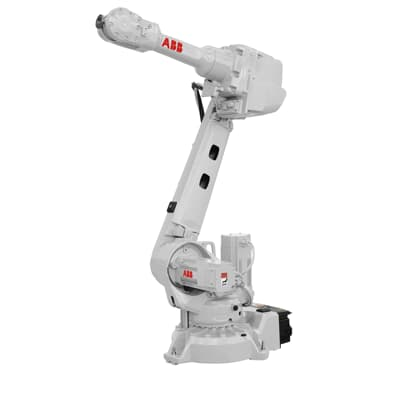
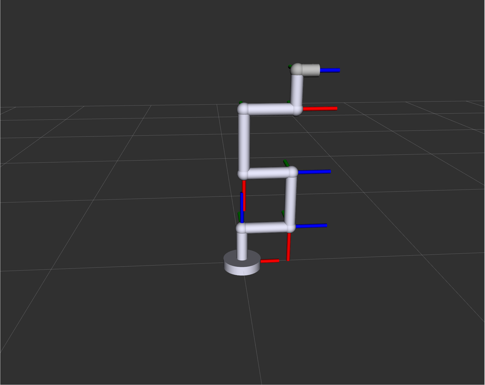
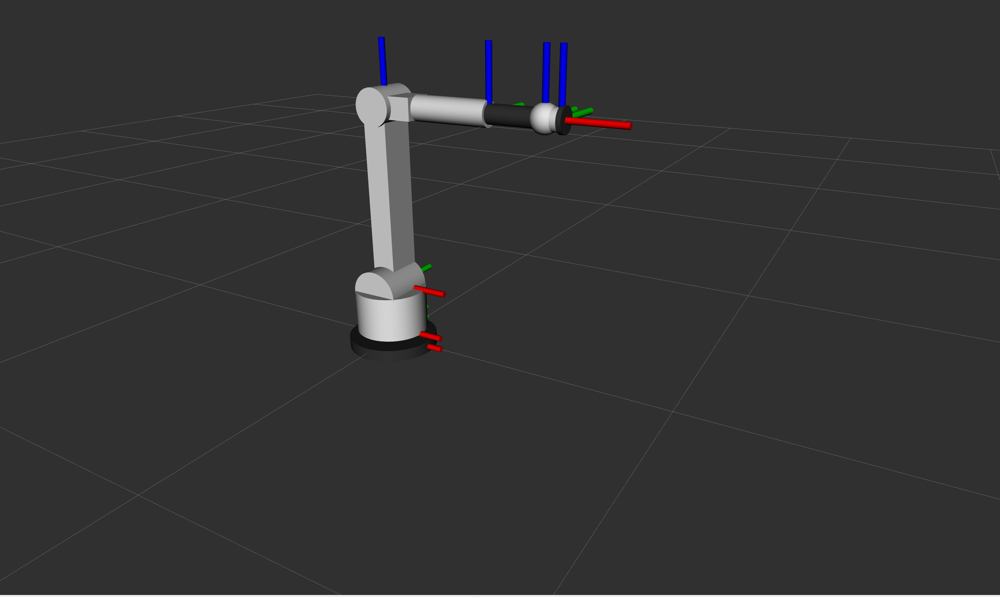
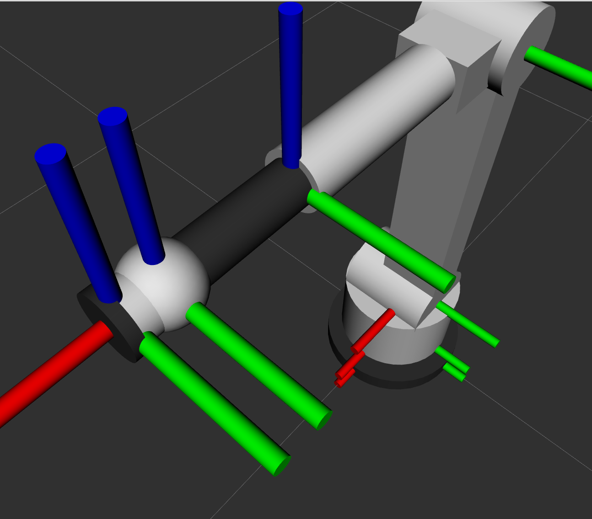
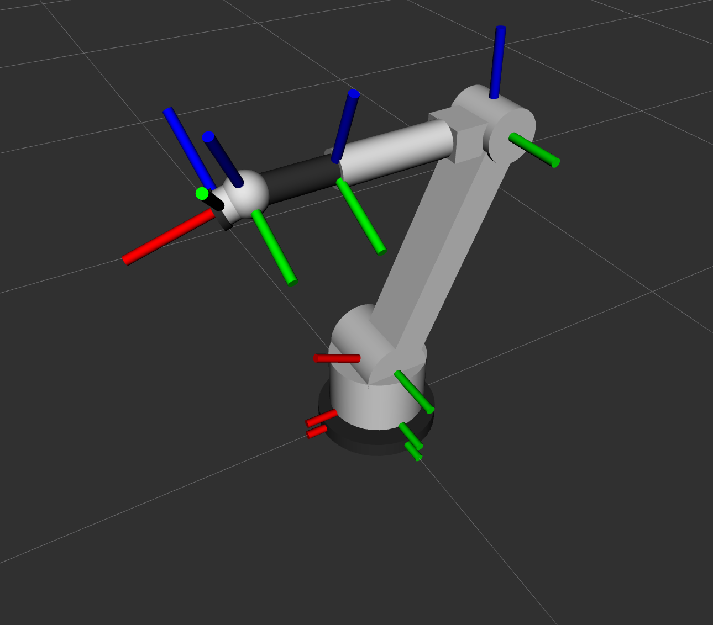

## Assignment Implementation: EE5531 Project 2
**Author:** Anders Smitterberg

# Project 2: 6-Axis Manipulator & Gimbal Lock Analysis
This repository contains a ROS 2 package for a 6-axis industrial robotic manipulator. This project aims to demonstrate gimbal lock on a robot inspired by the ABB IRB 2600.

### Prerequisites
* Ubuntu 24.04 (Noble)
* ROS 2 Jazzy

### Initial Setup and Testing
1. **Clone the repository:**
    ```bash
    git clone https://github.com/Robust-Autonomous-Systems-Laboratory/Project2_jasmitte
    cd Project2_jasmitte
    ```
2. **Install Dependencies:**
    * Update rosdep and install the necessary dependencies:
    ```bash
    rosdep update
    rosdep install --from-paths src --ignore-src -y
    ```
3. **Build the workspace:**
    ```bash
    colcon build
    ```
4. **Source the environment:**
    ```bash
    source install/setup.bash
    ```
5. **Launch the visualization:**
    * Launch RViz and the User Interface (GUI) to interact with the robot:
        ```bash
        ros2 launch urdf_tutorial robot_6_dof.launch.py
        ```
6. **Control Interface:**
    Instead of using rqt for joint manipulation, this project utilizes the joint state publisher and joint state publisher gui nodes provided in the original repository. This interface is used because it is more intuitive for the manual manipulation required to demonstrate gimbal lock.

---

### Custom URDF & Gimbal Lock

#### The ABB IRB 2600


This robot model was built to replicate the ABB IRB 2600, a robot I have personally worked with in the field.

By modeling this robot, we can demonstrate a real issue encountered in industrial robotics, wrist singularities.

While the file structure was based on the original tutorial repository (shown below), I remade the URDF from to match the kinematics and visual style of the real IRB 2600. I also included inertia and collision models like the toutorials suggest. Also interestingly the robot from the original repo was designed to avoid singularities (gimbal lock) if interested clone the original repo and take a look. there are lots of unneccesary 90 degree angles and careful designing of link lengths to avoid singularities.


*Above: The original robot model from the tutorial repository.*


*Above: My custom URDF modeling the IRB 2600.*

#### Gimbal Lock (Singularity)
Often Gimbal Lock occurs in 6-axis industrial robotics, where this is known as a singularity. I demonstrate a wrist singulatiry here.

*   **How it occurs:** This occurs specifically when Joint 5 (Wrist Pitch) is at 0 degrees. In this configuration, the axis of rotation for Joint 4 becomes perfectly aligned (collinear) with the axis of rotation for Joint 6.
*   **Consequences:** This alignment results in a loss of one Degree of Freedom (DOF). The robot momentarily loses the ability to rotate around the axis perpendicular to J4/J6.
*   **Effects:** In the field, when an industrial robot passes near this singularity, the controller attempts to maintain tool orientation by spinning J4 and J6 (or whatever axes are inline with each other) at infinite velocities in opposite directions. This manifests as violent movement, or sometimes execution stops.

#### Depiction

*Above: Singularity achieved. Axes 4 and 6 are inline.*


*Above: Normal operation. Axes are not aligned.*

**To reproduce this in the simulation:**
1.  Launch the robot using the command above.
2.  In the Joint State Publisher GUI, set the slider for j5 to 0.0.
3.  Attempt to move j4 and j6. You will observe that they now rotate the end-effector along the exact same axis.
4.  The robot has effectively "locked" itself out of the additional orientation axis until j5 is moved.

---

### Credits
This project architecture is based on the [urdf_tutorial](https://github.com/karansspk462000/urdf_tutorial) repository by Karan. The original package provided the file structure, which was refactored to implement the IRB 2600 URDF and fixed other bugs.

### AI Disclosure
Google Gemini was used to assist with the redesign of the URDF, assistance was also utilized to troubleshoot ROS 2 Jazzy launch file compatibility issues and to format this README professionally.
